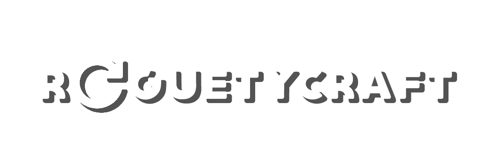

[](https://github.com/himar33/RoguetyCraft/blob/main/LICENSE)

**RoguetyCraft** is a specialized toolkit developed in Unity, designed to facilitate and optimize the creation of roguelike genre video games.

#### Table of Contents
* [About](#about)  
* [Features](#features)
* [Installation](#installation)
* [Usage](#usage)
* [Contribution](#contribution)
* [Contact](#contact)
* [License](#license)

## About
Developed by **Himar Bravo González** as a final degree work for the course **Diseño y Desarrollo de Videojuegos** at CITM, 2021-22. This toolkit aims to provide developers with a robust set of tools to streamline the development of roguelike games in Unity.

**RoguetyCraft** is an immersive roguelike game crafted with Unity, offering players a unique blend of strategy, action, and exploration. Dive deep into procedurally generated dungeons, face menacing enemies, and collect rare items to enhance your journey. With its dynamic gameplay mechanics and captivating visuals, RoguetyCraft promises an unforgettable gaming experience.

|  | 
|:--:| 
| *Gameplay example* |

## Features
* **Enemy System**: Define and customize enemy behavior, including health, movement, and animations.
* **Item System**: Create various types of items, from consumables to weapons, with interaction and usage capabilities.
* **Editor Map**: Utility methods for creating room templates and managing tilemaps directly in Unity's editor.
* **Player Controller**: Manage player movement, weapons, and animations with ease.

## Installation
#### Unitypackage Method
1. Download the latest **RoguetyCrafy UnityPackage** from the [Releases page](https://github.com/himar33/RoguetyCraft/releases).
2. **Open** your Unity project.
3. Go to "Assets" in the top menu and select **"Import Package" > "Custom Package..."**
4. **Locate** the downloaded RoguetyCraft UnityPackage and **select it**.
5. The UnityPackage will be imported into your project, and you can start using TimerTool immediately.

#### Source Code Method
1. **Clone or download** the RoguetyCraft GitHub repository, or just click [HERE](https://github.com/himar33/TimerTool-Unity-Utility/archive/refs/heads/main.zip).
2. **Open** Unity and **create** a new project or use an existing one.
3. **Drag and drop** the TimerTool source code files and folders into the "Assets" folder of your Unity project.
4. Unity will import the RoguetyCraft scripts, and you can now start using RoguetyCrafty in your project.

## Usage
The **RoguetyCraft Toolkit** is designed to be intuitive, allowing both novice and experienced Unity developers to craft roguelike games with ease. Here's how to get the most out of this toolkit:
### Setting Up Your Scene
1. **Initialization**: Begin by importing the RoguetyCraft toolkit into your Unity project. Navigate to the main folder to access all the toolkit's features.

2. **Scene Creation**: Create a new scene or use an existing one. Ensure that the main camera is set up to capture the gameplay area effectively.

### Crafting Enemies with the Enemy System
1. **Enemy Creation**: Navigate to the Enemy script. Here, you can define various properties such as health, movement speed, target distance, and more.

|  | 
|:--:| 
| *Enemy Scriptable Object Inspector* |

|  | 
|:--:| 
| *Skeleton GameObject on scene* |

2. **Animations**: The toolkit supports custom animations for enemies. Assign your animation clips and set up the desired transitions.

### Designing Items with the Item System
1. **Item Types**: The toolkit supports various item types, including consumables, weapons, keys, and power-ups. Choose the type that fits your game's needs.

|  | 
|:--:| 
| *Item Controller Inspector* |

|  | 
|:--:| 
| *Item GameObject on scene* |

2. **Interaction & Usage**: Each item can have custom interactions. Define what happens when a player interacts with or uses an item.

### Building Levels with the Editor Map
1. Room Templates: Use the utility methods provided to create room templates directly in Unity's editor. This allows for quick level design and iteration.

|  | 
|:--:| 
| *Steps to create a room scriptable object* |

2. Tilemaps: Manage and customize tilemaps to design intricate level layouts. The toolkit supports various tiles, allowing for diverse level designs.

|  | 
|:--:| 
| *Level Graph Editor Window* |

### Controlling the Player with the Player Controller
1. Movement & Weapons: The Player Controller script allows you to manage player movement and weapons seamlessly. Toggle between different movement types and assign weapons as needed.

|  | 
|:--:| 
| *Player Movement Inspector* |

2. Animations: Just like with enemies, the toolkit supports custom player animations. Design your player's look and feel with a range of animation options.

|  | 
|:--:| 
| *Player GameoObject on scene* |

3. Interactions: Players can interact with various game elements, from items to NPCs. Define custom interactions to enrich your game's experience.

## Contribution
Pull requests are welcome. For major changes, please open an issue first to discuss what you would like to change.

## Contact
Himar Bravo González - [@himarsus](https://twitter.com/himarsus) - himarbravogonzalez@gmail.com

Project Link: https://github.com/himar33/RoguetyCraft

## License
```
MIT License

Copyright (c) 2023 himarsus

Permission is hereby granted, free of charge, to any person obtaining a copy
of this software and associated documentation files (the "Software"), to deal
in the Software without restriction, including without limitation the rights
to use, copy, modify, merge, publish, distribute, sublicense, and/or sell
copies of the Software, and to permit persons to whom the Software is
furnished to do so, subject to the following conditions:

The above copyright notice and this permission notice shall be included in all
copies or substantial portions of the Software.

THE SOFTWARE IS PROVIDED "AS IS", WITHOUT WARRANTY OF ANY KIND, EXPRESS OR
IMPLIED, INCLUDING BUT NOT LIMITED TO THE WARRANTIES OF MERCHANTABILITY,
FITNESS FOR A PARTICULAR PURPOSE AND NONINFRINGEMENT. IN NO EVENT SHALL THE
AUTHORS OR COPYRIGHT HOLDERS BE LIABLE FOR ANY CLAIM, DAMAGES OR OTHER
LIABILITY, WHETHER IN AN ACTION OF CONTRACT, TORT OR OTHERWISE, ARISING FROM,
OUT OF OR IN CONNECTION WITH THE SOFTWARE OR THE USE OR OTHER DEALINGS IN THE
SOFTWARE.
```
